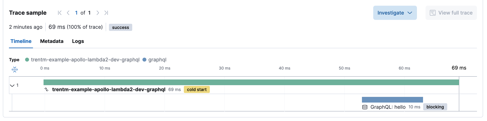

An example repo using apollo-server-lambda and instrumenting/monitoring it
with Elastic APM ('elastic-apm-node') per
https://www.elastic.co/guide/en/apm/agent/nodejs/current/lambda.html

This is to debug https://github.com/elastic/apm-agent-nodejs/issues/2832.

# prerequisites

- You have the AWS CLI setup with credentials.
- `npm install -g serverless` for the `serverless` CLI.
- You have an Elastic stack with APM configured. See https://www.elastic.co/guide/en/apm/guide/current/apm-quick-start.html


# setup

1. Clone this repo.
2. `npm install`
3. Create a ".env" file that points to your APM server something like this:
    ```
    ELASTIC_APM_LAMBDA_APM_SERVER=https://...
    ELASTIC_APM_SECRET_TOKEN=...
    ```
4. (Optional.) Change the `service: ...` name in "serverless.yml" to be
   prefixed with your name instead of "trentm-". If you do change this, then
   some of the strings/commands below change to match.
5. Deploy: `serverless deploy`.
6. Invoke your function at least once: `serverless invoke -f graphql -p query.json`

In your Kibana APM app, you should see an "trentm-example-apollo-lambda" service
with a "trentm-example-apollo-lambda2-dev-graphql" transaction. The trace for
this should have a "GraphQL: hello" span. For example:



You should be able to watch logs of your Lambda function via:

```
aws --region us-east-1 logs tail --follow /aws/lambda/trentm-example-apollo-lambda2-dev-graphql
```

You should be able to poke around with your Lambda function in the AWS Console at:
https://us-east-1.console.aws.amazon.com/lambda/home?region=us-east-1#/functions/trentm-example-apollo-lambda2-dev-graphql?tab=code

# notes / troubleshooting

I followed https://www.apollographql.com/docs/apollo-server/deployment/lambda/
to set this up. However, you cannot use "graphql.js" as the handler file name
because of a limitation in the Elastic APM Node.js agent. If you do, you'll
hit this warning:

    "message": "Unable to instrument Lambda handler \"graphql.graphqlHandler\" due to name conflict with \"graphql\", please choose a different Lambda handler name"

